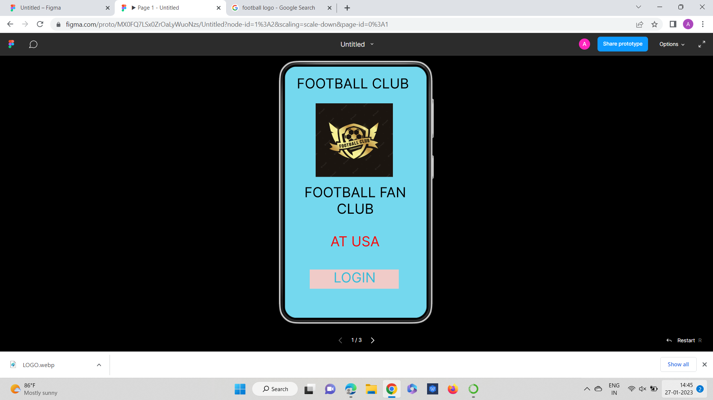
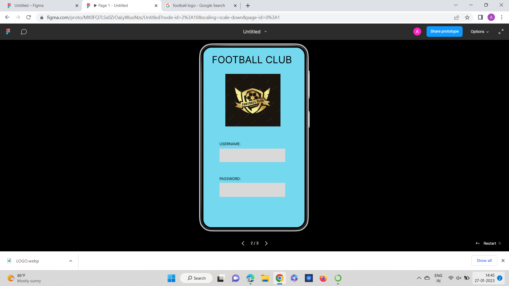
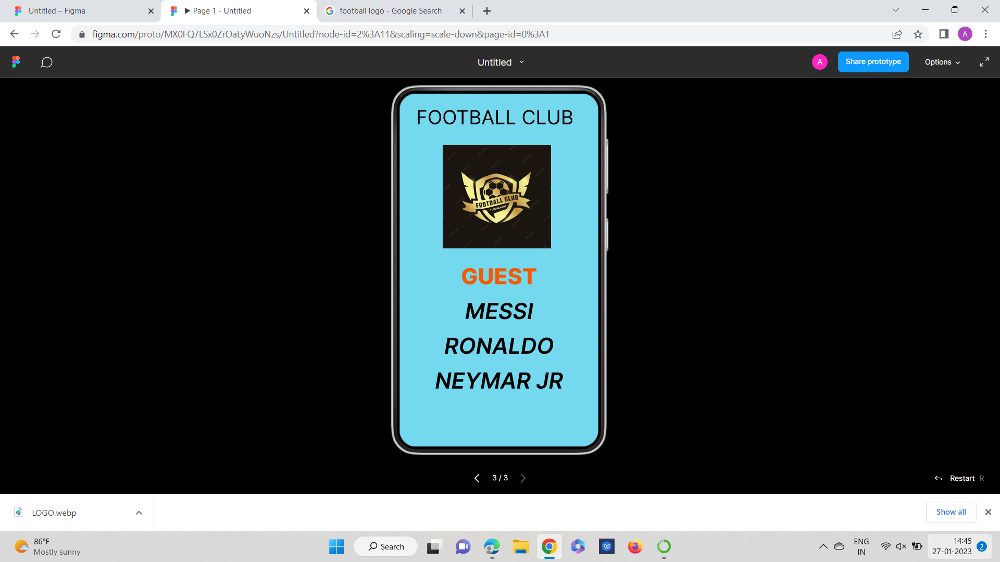

# Event Registration Web Application

## AIM:
To design, develop and deploy a web application for event registration.

## DESIGN STEPS:

### Step 1:
choose a colour palette and idea for the webpage with your team members.

### Step 2:
open Figma and create a new project file and share the invite to your team members.

### Step 3:
start making the UI desgin for wed page


### Step 4:
After completing the design exoprt it to PDF

### Step 5:
validate thbe HTML and CSS CODE


### Step 6:

Publish the website in the given URL.

## DESIGN:

## PROGRAM :
```
/* HOME PAGE */


position: relative;
width: 360px;
height: 640px;

background: #74D8EE;


/* LOGIN PAGE */


position: relative;
width: 360px;
height: 640px;

background: #74D8EE;


/* GUEST */


position: relative;
width: 360px;
height: 640px;

background: #74D8EE;
```

## OUTPUT:





## Result:

Hence the UX design for the event registration webpage is done

